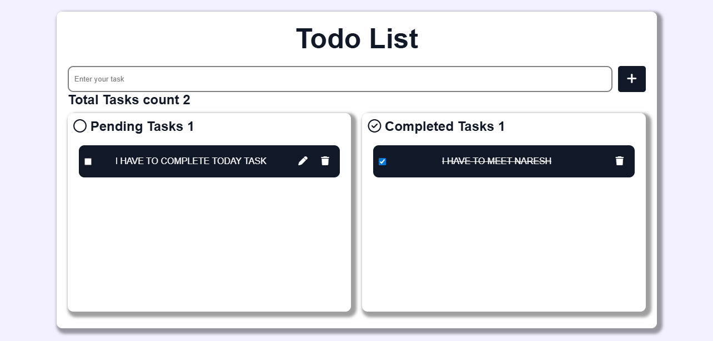

# 📝 To-Do List App

A simple, clean, and responsive To-Do List application built using **HTML**, **SCSS**, and **JavaScript**.  
This app helps users organize their daily tasks by adding, editing, completing, and deleting tasks easily.

## 🚀 Features

- ➕ Add new tasks  
- ✏️ Edit existing tasks  
- ❌ Delete tasks  
- ✅ Mark tasks as completed  
- 🎨 Clean UI with SCSS styling  
- 📱 Fully responsive design  

## 📸 Screenshot



## 🛠️ Technologies Used

- **HTML5** – Structure of the app  
- **SCSS** – Styling with better organization and reusability  
- **JavaScript (ES6)** – App functionality and interactivity  

## 📂 Project Structure
```
ToDo-List-App/
│
├── index.html
├── scss/
│ └── style.scss
├── css/
│ └── style.css
├── script.js
│ 
└── README.md
```

## ⚙️ How to Run the Project

1. Clone the repository  
```bash
git clone https://github.com/abhishekgorinta/to-do-list.git
```
2. Navigate to the project folder

    cd todo-list-app


3. Open index.html in your browser
   OR use Live Server in VS Code.
## 👨‍💻 Author:

Developed by Abhishek Gorinta


## License:

This project is free to use and modify for learning purposes.

⭐ If you like this project, don't forget to give it a star on GitHub!

